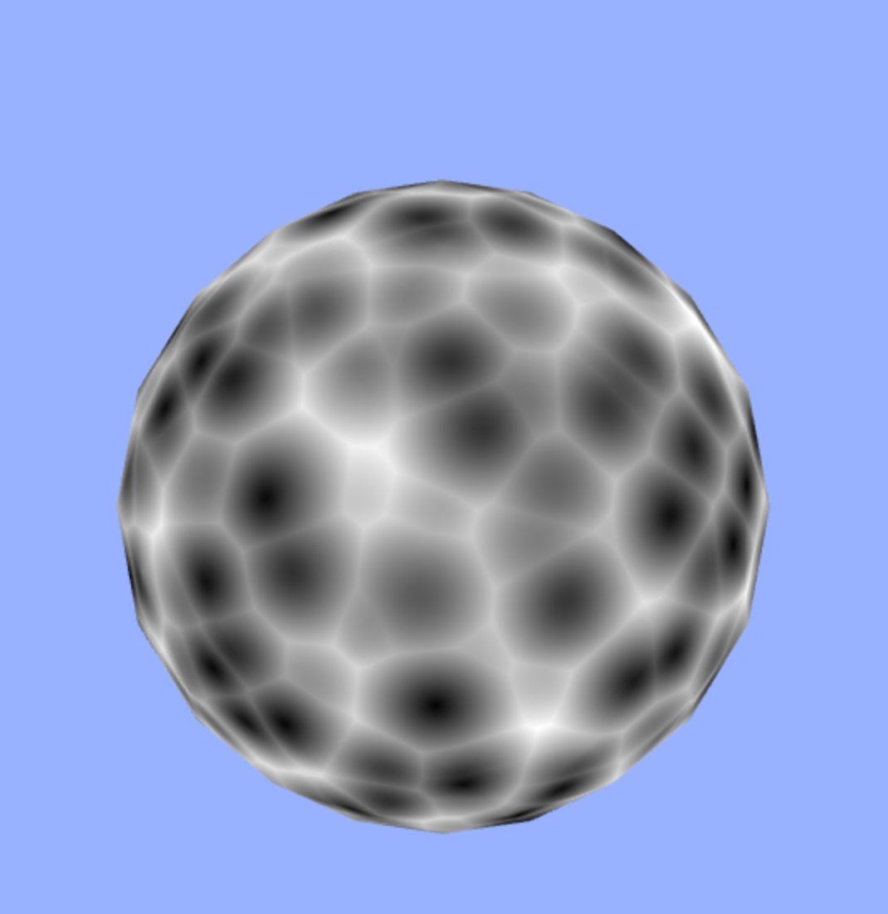

# glsl-worley



From this module, a GLSL implementation of Worley Noise written by [Stefan
Gustavson](http://webstaff.itn.liu.se/~stegu/GLSL-cellular/GLSL-cellular-notes.pdf) can be imported.

A demo can be found [here]()

## Usage

This module provides four functions, and they can be exported as

```glsl
#pragma glslify: worley3D = require(glsl-worley/worley3D.glsl)
#pragma glslify: worley2x2x2 = require(glsl-worley/worley2x2x2.glsl)
#pragma glslify: worley2D = require(glsl-worley/worley2D.glsl)
#pragma glslify: worley2x2 = require(glsl-woryley/worley2x2.glsl)
```

`worley3D` is defined as `vec2 worley3D(vec3 P, float jitter, bool manhattanDistance)`. It returns a `vec2`
 where `x` is `F1` and `y` is `F2`(it is assumed that the reader knows the meaning of these two).
`P` is the input point, `jitter` is the amount of jitter in the pattern, and if `manhattanDistance` is true,
then a manhattan distance is used to generate the pattern, instead of the usual Euclidean distance(this basically makes
 the noise appear more "jagged").

 The remaining three functions take the same arguments, except that in the case of `worley2D` and `worley2x2`, `P` is a
 `vec2`.

 `worley2x2x2` is basically a faster version of `worley3D`. But be aware that it has some artifacts. In the same manner,
 `worley2x2` is basically a faster version of `worley2D`, but with some potential artifacts.


